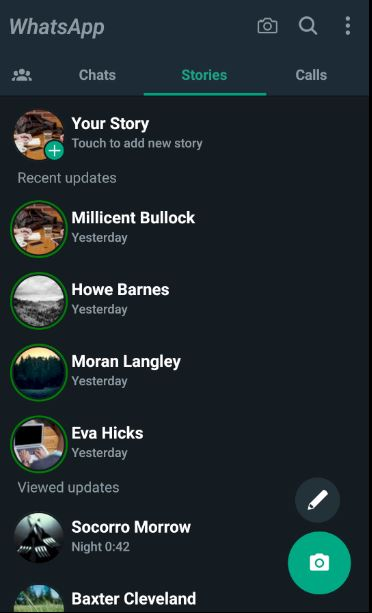
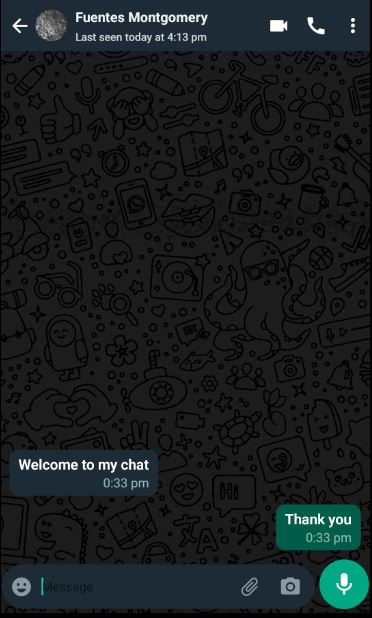
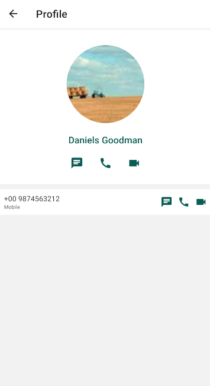
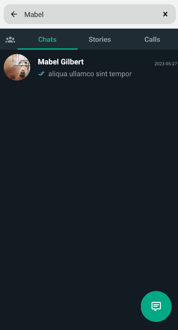
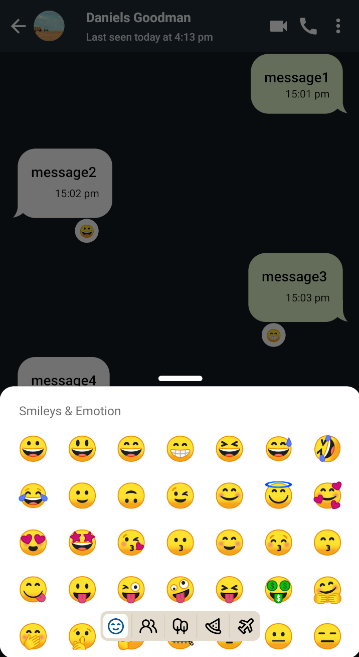

## Features

- Chats
- Stories - Status
- Calls
- Messages - "when you press a message" : You can send a message but it doesn't store.
- Profile
- Search
- Reaction Bubble

## Initial Setup

1. Install the package

```bash
npm install
```

2. Run the application

```bash
npm run android
```

or if want to open metro 

```bash
npm start
```

## Screenshots








